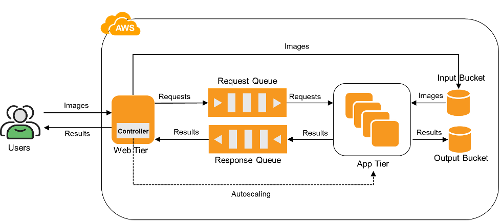

## Project-1-IaaS/Part-II/README.md

# Project 1 – Part II: IaaS – Full Multi-Tier with Autoscaling

This part extends Part I by adding:

- A backend app tier (using a PyTorch model)
- Autoscaling controller

## Architecture

- **Web Tier:** server.py on EC2
- **App Tier:** backend.py EC2s launched from AMI
- **Controller:** controller.py for autoscaling logic
- **SQS Queues:** `<ASUID>-req-queue`, `<ASUID>-resp-queue`

## Architecture Diagram

## Setup

- Create and configure SQS queues
- Train AMI with model code and dependencies
- Launch/stops app-tier EC2s based on SQS load

## Highlights

- No AWS Auto Scaling service used
- Scales to 15 EC2s based on load
- Entirely Python-based

## Deep Learning Model used for inference
https://github.com/CSE546-Cloud-Computing/CSE546-SPRING-2025/tree/model
