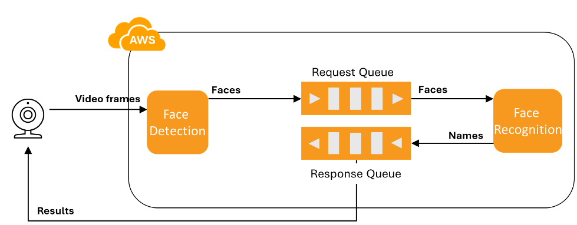

# Project 2 – Part I: PaaS – Lambda + ECR Face Recognition Pipeline

This part implements a two-stage serverless architecture using AWS Lambda and Elastic Container Registry (ECR) for face detection and recognition.

## Architecture

- **Stage 1:** `face-detection` Lambda detects faces
- **Stage 2:** `face-recognition` Lambda identifies faces
- **Image Transfer:** SQS queues are used to connect the two stages asynchronously

## Architecture Diagram

## Setup

1. Build a Docker image with all required dependencies
2. Upload the image to AWS Elastic Container Registry (ECR)
3. Deploy the Lambda functions using the ECR image
4. Configure Function URLs and connect SQS queues

## Tools & Libraries

- `facenet_pytorch`
- `torch`
- `opencv-python`
- `boto3`

## Reference
Face recognition: https://github.com/CSE546-Cloud-Computing/CSE546-SPRING-2025/blob/lambda/face-recognition/lamda_function.py
Face detection: https://github.com/CSE546-Cloud-Computing/CSE546-SPRING-2025/blob/lambda/face-detection/lamda_function.py
Dockerfile: https://github.com/CSE546-Cloud-Computing/CSE546-SPRING-2025/blob/lambda/Dockerfile
Model weights: https://github.com/CSE546-Cloud-Computing/CSE546-SPRING-2025/blob/model/resnetV1/resnetV1_video_weights.pt

