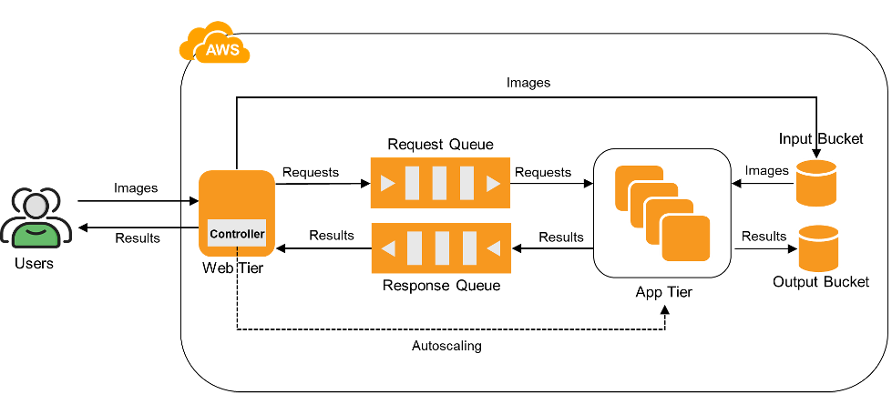

# Project 2 – Part II: Edge Computing with AWS Greengrass

This part moves face detection to a local (emulated) IoT device running Greengrass. Face recognition remains in the cloud via Lambda.

## Architecture

- **Greengrass Core Device:** EC2 running face detection as component
- **IoT Client Device:** Publishes images via MQTT
- **Cloud Recognition:** Lambda function classifies detected faces

### Architecture Diagram

## Setup

- Install Greengrass on EC2 (core)
- Create and deploy component (`fd_component.py`) with recipe and artifact
- Setup client device to publish MQTT messages

## Highlights

- Uses AWS IoT Greengrass v2
- Edge inference with real-time publishing
- Uses MQTT over TLS
